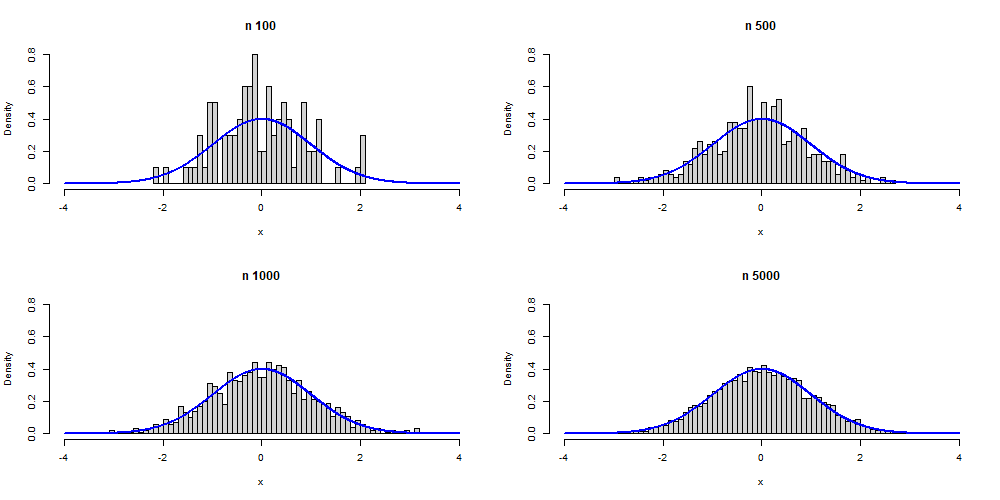

```{r}
sessionInfo()
```

install.packages("knitr")

# Text Formatting
-----------------
*itailic* _italic_
**bold** _bold_
superscript^2^ subscript~2~

# Heading
---------
# 1st level header
## 2nd level header
### 3rd level header

# Lists
-------
* Bulleted list item 1
* Item 2

1. Item 1
2. Item 2
2. Item 3

## Tables
------------
First Header | Second Header
-------------|--------------
A1 | A2
B1 | B2

## create chunks
-----------------
```{r, cars, include=TRUE, comment=""}
summary(cars)
```
```{r, setup, include=FALSE}
library(ggplot2) #include will determine if code chunks are visible
library(dplyr)
smaller = diamonds %>%
  filter(carat <= 2.5)
```

```{r, echo=TRUE}
smaller %>% #echo will include the code output with the graph
  ggplot(aes(carat))+
  geom_freqpoly(bindwidth=0.01)
```

```{r, pressure, echo=FALSE, out.width="60%", fig.align='center'}
plot(pressure)
```

## Insert Images/Pictures
-------------------------
```{r}
getwd()
```

```{r, echo=FALSE, out.width="100%"}

```

{width="60%"}

## Histogram
```{r}
x = rbinom(n = 50, size = 10, prob = 0.1)
hist(x, freq=F, breaks=seq(-0.5, 10.5, 1))
```
?mtcars
attach(mtcars)

```{r}
counts = table(mtcars$cyl)
counts = as.vector(counts)
xx = barplot(counts, main="Car distribution by Cylinders",
             xlab = "Number of Cylinders", 
             ylim=c(0, max(counts)+3),
             col = "deeppink")
text(x = xx, y = counts+1, label=as.character(counts),
     cex=1.3, col="darkblue")
```

```{r}
mtcars[1:5, 1:10]
```

```{r}
knitr::kable(mtcars[1:5,], caption = "A knitr kable")
```

```{r}
knitr::kable(mtcars[1:6, 1:7], caption = "A subset of mtcars")
```
## We use xtable package to get the following table
```{r, results='asis'}
library(xtable)
options(xtable.comment = F)
print(xtable(mtcars[1:6, 1:7], caption = "Table using xtable packages"), align='center', type='latex')
```

```{r}
stargazer::stargazer(data=mtcars[1:6, 1:7], header=F, type="latex", title="Table created by stargazer")
```

## Links
[RStudio](https://posit.co/)
[Dataset](https://archive.ics.uci.edu/ml/datasets/Absenteeism+at+work)

## Inline Code
```{r}
x = c(2.2, 7, 4, -6.2)
mean(x)
```
The mean of the vector `x` is `r mean(x)`

We have data about `r nrow(diamonds)` diamonds. Only `r nrow(diamonds)-nrow(smaller)` are larger than 2.5 carats.

